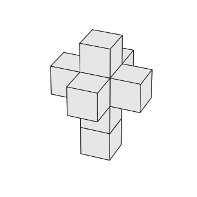

# ChronoTVA

## Table of Contents
- [Overview](#overview)
- [Features](#features)
- [Requirements](#requirements)
- [Installation](#installation)
- [Usage](#usage)
- [Command-Line Arguments](#command-line-arguments)
  - [Image Size](#image-size)
- [Examples](#examples)
  - [Default Parameters](#default-parameters)
  - [Custom Colors and Output Format](#custom-colors-and-output-format)
  - [Adjusting View Angles](#adjusting-view-angles)
  - [High-Resolution Output](#high-resolution-output)
  - [Image Size in Pixels](#image-size-in-pixels)
  - [Image Size in Inches](#image-size-in-inches)
  - [Selective Unfolding and Axis Display](#selective-unfolding-and-axis-display)
  - [Custom Output Directory](#custom-output-directory)
  - [Combination of Various Options](#combination-of-various-options)
  - [Full Customization](#full-customization)
- [Further Reading](#further-reading)
  - [Embeddings](#embeddings)
- [License](#license)
- [Contact](#contact)

## Overview
<p align="center">
  
</p>

ChronoTVA (The **Chrono**mancer's **T**esseract **V**isualization **A**id) is a Python 3.9+ command-line tool designed for generating images from three-dimensional coordinates of unfoldings of a tesseract.

This has been tested with Python **3.9**, **3.10**, **3.11**, and **3.12**. The only dependency is **matplotlib**.

For more information on the unfolding process, please read the [Further Reading](#further-reading) section.

## Features

- **Color Customization**: Customize block and edge colors using RGBA format or named colors.
- **View Angle Adjustment**: Set elevation and azimuth angles for 3D plot perspective.
- **Output Format Options**: Generate images in PNG, SVG, or PDF format.
- **Image Dimensions & DPI**: Control the dimensions and resolution (DPI) of the output image.
- **Transparency and Shading**: Option to enable transparency and shading in the plot.
- **Axis Display**: Toggle the display of axes in the plot.
- **Automatic Output Directory Management**: Saves plots to a specified directory or creates a default one based on the current date and time.
- **Selective Unfolding ID Plotting**: Plot specific unfoldings by providing their numeric identifiers.
- **Whitespace Removal**: Automatically remove whitespace around the image.
- **Flexible Dimension Specifications**: Set image dimensions either in pixels or inches.
- **Robust Error Handling**: Includes validations and error handling for input arguments and plot configurations.
- **Command-Line Interface**: Offers a user-friendly command-line interface for configuring and running the plotting process.
- **Dynamic Plotting Capabilities**: Capable of plotting varying data sets based on provided unfolding IDs.


## Requirements

- Python 3.9+
- Matplotlib

## Installation

1. Ensure Python 3.9 or higher is installed on your system.
2. Install via pip:
```bash
pip install chronotva
```

## Usage

Run the script from the command line. Default values will be used and an output directory with the current date and time will be created.
```bash
chronotva
``` 
You can also specify the desired parameters. For example:
```bash
chronotva --block-color "255,0,0,1" --edge-color "0,255,0,1" --output-format png
```

## Command-Line Arguments

- `-b, --block-color`: Block color in RGBA format or color name. Default: '230,230,230,1'
- `-e, --edge-color`: Block edge color in RGBA format or color name. Default: '25,25,25,1'
- `-v, --elevation`: Elevation angle for the plot in degrees. Default: 30
- `-a, --azimuth`: Azimuth angle for the plot in degrees. Default: 22.5
- `-f, --output-format`: Output file format (png, svg, pdf). Default: 'svg'
- `-d, --output-dir`: Output directory for the plots.
- `-p, --dpi`: DPI for the output image. Default: 300
- `-t, --transparent`: Enable transparency in the output image. Default: True
- `-s, --shade`: Enable shading in the 3D plot. Default: False
- `-x, --show-axes`: Show axes in the plot. Default: False
- `-w, --whitespace-removal`: Remove whitespace around the image. Default: True
- `-u, --unfolding-ids`: Comma-separated numeric identifiers of unfoldings to plot.

### Image Size
For image size, you can provide either pixel height and width, or inch height and width. Pixels will be converted to inches based off of the DPI value provided, 300 by default.
- `--pixel-height`: Height of the output image in pixels.
- `--pixel-width`: Width of the output image in pixels.  

Or provide:
- `--inch-height`: Height of the output image in inches. Default: 6.4
- `--inch-width`: Width of the output image in inches. Default: 4.8

If you want the image to be the exact size in pixels and inches with no trimming, make sure to pass in **--whitespace-removal false**.

## Examples

### Default Parameters
Run ChronoTVA with default parameters. This will generate an SVG image with default colors, dimensions, and angles, saving it in a directory named with the current date and time.
```bash
chronotva
```

### Custom Colors and Output Format
Generate a PNG image with red blocks and green edges. 
```bash
chronotva --block-color "255,0,0,1" --edge-color "0,255,0,1" --output-format png
```

### Adjusting View Angles
Set a specific elevation and azimuth angle for a different perspective. 
```bash
chronotva --elevation 45 --azimuth 45
```

### High-Resolution Output
Create a high-resolution image with increased DPI and transparency enabled. 
```bash
chronotva --dpi 600 --transparent true
```

### Image Size in Pixels
Generate an image with specific pixel dimensions, ensuring no whitespace removal for exact sizing.
```bash
chronotva --pixel-height 1080 --pixel-width 1920 --whitespace-removal false
```

### Image Size in Inches
Create an image with custom dimensions in inches, using SVG format. 
```bash
chronotva --inch-height 8 --inch-width 10 --output-format svg
```

### Selective Unfolding and Axis Display
Plot specific unfoldings of the tesseract and display axes.
```bash
chronotva --unfolding-ids 1,3,5 --show-axes true
```

### Custom Output Directory
Save the generated images in a specified directory.
```bash
chronotva --output-dir "/path/to/custom/directory"
```

### Combination of Various Options
A combination of various options, including color customization, view angle adjustment, and selective unfolding plotting.
```bash
chronotva --block-color "blue" --edge-color "yellow" --elevation 60 --azimuth 30 --unfolding-ids 2,4,6
```

### Full Customization
Fully customize the image with block and edge colors, DPI, transparency, shading, axis display, whitespace removal, and image size in pixels.
```bash
chronotva --block-color "128,0,128,0.5" --edge-color "255,165,0,1" --dpi 450 --transparent true --shade true --show-axes true --whitespace-removal false --pixel-height 1200 --pixel-width 1600
```

### Further Reading

The [unfoldings](https://github.com/mo271/mo271.github.io/blob/main/mo/198722/cube-unfoldings.txt) were created by [Moritz Firsching](https://github.com/mo271) and are from [exploring](https://github.com/mo271/mo271.github.io/blob/main/mo/198722/unfolding%20the%20hypercube.ipynb) how a tesseract, a four-dimensional hypercube, can be projected or unfolded into three-dimensional space. This process systematically analyzes the geometric relationships and connectivity of all cubes composing the tesseract. The process reveals 261 unique configurations, each representing a distinct unfolding of the tesseract, which can be visualized or rendered in three-dimensional space. 

For a much more thorough explanation of the complete unfolding process, check out [Unfolding the Tesseract](https://unfolding.apperceptual.com/) by [Peter D. Turney](https://www.apperceptual.com/) from the Journal of Recreational Math.


## License

This software is released under the MIT License.

## Contact

For support or contributions, please contact [Jacob 'the-chronomancer' Coleman](mailto:jacob.wade.coleman@gmail.com).